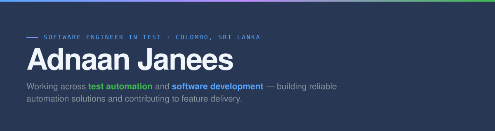

  

  <code>BEng (Hons) Software Engineering · Coventry University, UK</code> &nbsp; <code>Previously Virtusa</code>

  
  

### 🔵 Full-Stack Development

### 🟢 Test Automation

### 🟠 Performance Testing

### 🟣 Languages

